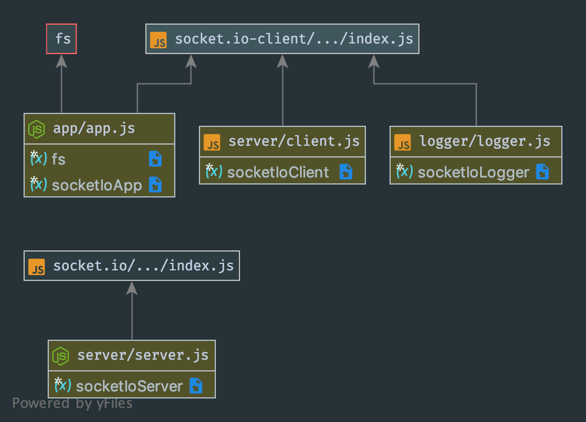

# LAB - 17

 ## Socket.io

 ### Author: Evan Brecht-Curry

 ### Links and Resources
* [submission PR](https://github.com/evan-401-advanced-javascript/lab-17-socket-io/pull/1)
* [docs](http://localhost:3000/docs/)

 ##### Exported Values and Methods
`readFile -  Function uses fs to read file and then calls change case`
`changeUppercase - unction uses toUppercase to change file to uppercase and then calls updatingFile`
`updatingFile - function uses fs to write the changes to the file and then uses socket to call server.js`

### Setup
#### `.env` requirements
run on port 3000

 #### UML
